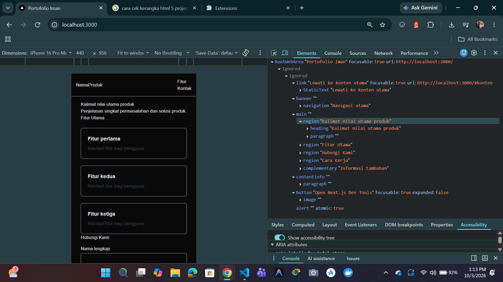
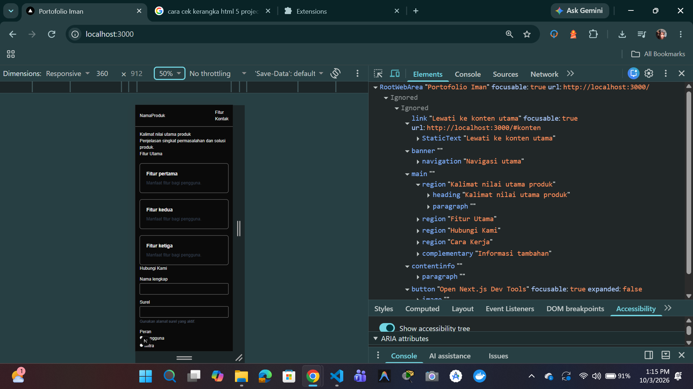
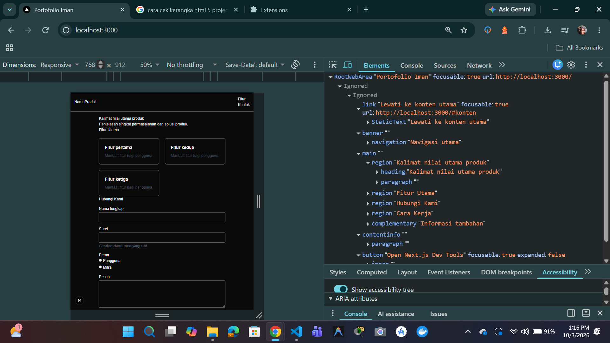
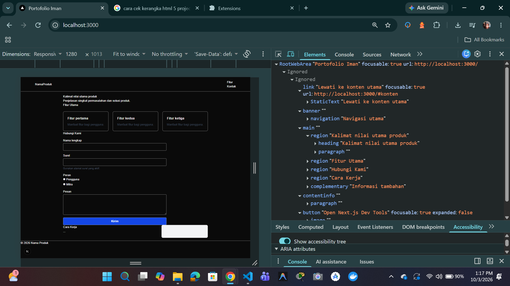

# Dokumen Teknis Modul 2 HTML Semantik, Tailwind CSS, dan Aksesibilitas

**Nama/NIM**  : Iman Dwi Satrio / 105224029  
**Repositori**: https://github.com/imanseng/105224029_PrakPemWeb

---

## 1. Struktur Semantik

### Kerangka Landmark dan Hierarki Judul
Halaman utama dibangun menggunakan elemen semantik HTML5:
- `<a href="#konten">`: *skip link* disembunyikan menggunakan `sr-only` dan muncul saat menerima fokus untuk memudahkan navigasi papan ketik.
- `<header>`: Berperan sebagai landmark `banner` yang memuat logo dan navigasi utama.
- `<nav aria-label="Navigasi utama">`: Berperan sebagai landmark `navigation`.
- `<main id="konten">`: Berperan sebagai landmark `main` utama.
- `<section aria-labelledby="...">`: Berperan sebagai landmark `region` karena memiliki penanda judul yang dapat diakses dan membagi layout halaman.
- `<h1>`: Judul utama halaman ("Kalimat nilai utama produk").
- `<h2>` & `<h3>`: Menandai hierarki judul di setiap bagian fitur, tata letak konten, dan formulir kontak.
- `<footer>`: Berperan sebagai landmark `contentinfo` pada bagian footer halaman.

### Bukti Pohon Aksesibilitas
  

---

## 2. Tata Letak Responsif

### Tangkapan Layar Tampilan
- **Ukuran Seluler (360 px)**: 
- **Ukuran Tablet (768 px)**: 
- **Ukuran Desktop (1280 px)**: 

### Kelas Flexbox, Grid, dan Breakpoint
1. **Navigasi Utama (`<nav>`)**:
   - `flex flex-col gap-3 sm:flex-row sm:items-center sm:justify-between`
   - *Alasan*: Pada layar seluler (< 640 px), menu tersusun secara vertikal (kolom), ditandai dengan kelas flex-col. Mulai dari breakpoint `sm` (≥ 640 px), posisi diubah menjadi horizontal (baris) dengan distribusi sejajar kiri-kanan (`justify-between`), ditandai dengan kelas sm:flex-row.
2. **Daftar Kartu Fitur (`<ul>`)**:
   - `grid grid-cols-1 gap-6 sm:grid-cols-2 lg:grid-cols-3`
   - *Alasan*: Menerapkan pendekatan *mobile-first*. Pada layar seluler ditampilkan 1 kolom (grid-cols-1), layar sedang/tablet (`sm`) menjadi 2 kolom (sm:grid-cols-2), dan layar lebar/desktop (`lg`) menjadi 3 kolom grid (lg:grid-cols-3).
3. **Bagian Konten Utama dan Sidebar (`
`)**:
   - `grid gap-8 lg:grid-cols-[2fr_1fr]`
   - *Alasan*: Bertumpuk secara vertikal pada layar kecil/tablet, lalu berdampingan 2 kolom dengan rasio lebar 2:1 pada layar desktop (`lg`), ditandai dengan lg:grid-cols-[2fr_1fr].

---

## 3. Audit Aksesibilitas

### Skor Lighthouse
| Halaman | Skor Sebelum Perbaikan | Skor Sesudah Perbaikan |
| :--- | :---: | :---: |
| **Halaman Latihan Audit** (`/latihan-audit`) | 79 | 100 |
| **Halaman Utama Produk** (`/`) | 96 | 100 |

### Daftar Temuan Audit, Penyebab, dan Perbaikannya

#### A. Halaman Latihan Audit (`/latihan-audit`)
1. **`Buttons do not have an accessible name`**
   - *Penyebab*: Tombol pencarian hanya berisi ikon SVG tanpa teks terstruktur, sehingga *screen reader* membacanya sebagai tombol tanpa nama.
   - *Perbaikan*: Menambahkan atribut `aria-label="Cari"` pada elemen `<button>` dan `aria-hidden="true"` pada elemen `<svg>`.
2. **`Image elements do not have [alt] attributes`**
   - *Penyebab*: Elemen `` untuk logo Next.js (`/next.svg`) tidak memiliki atribut `alt`.
   - *Perbaikan*: Menambahkan atribut deskriptif `alt="Logo Next.js"`.
3. **`Form elements do not have associated labels`**
   - *Penyebab*: Kolom input pencarian `<input type="search">` tidak terhubung dengan label deskriptif.
   - *Perbaikan*: Menambahkan elemen `<label htmlFor="cari-alat" className="sr-only">Cari Alat</label>` yang terhubung melalui atribut `id="cari-alat"`.
4. **`Document does not have a main landmark`**
   - *Penyebab*: Konten halaman tidak terbungkus dalam elemen semantik `<main>`.
   - *Perbaikan*: Mengubah `
` pembungkus utama menjadi elemen semantik `<main>`.
5. **Rasio Kontras Rendah (`text-gray-300`)**
   - *Penyebab*: Teks paragraf menggunakan `text-gray-300` di atas latar terang, menyebabkan rasio kontras < 4,5:1.
   - *Perbaikan*: Mengganti kelas warna menjadi `text-white-700` agar teks terbaca jelas dan memenuhi kriteria WCAG 2.2 AA.
6. **Struktur Judul Non-Semantik (Temuan Pemeriksaan Manual Pohon Aksesibilitas)**
   - *Penyebab*: Judul katalog ditulis menggunakan elemen `
`.
   - *Perbaikan*: Mengubah `
` menjadi elemen `<h1>` untuk menegaskan hierarki judul utama.

#### B. Halaman Utama Produk (`/`)
1. **`Background and foreground colors do not have a sufficient contrast ratio`**
   - *Penyebab*: Pada tampilan *Dark Mode*, teks deskripsi kartu (`p.mt-2.text-gray-700`) dan teks petunjuk surel (`p#email-bantuan.text-gray-600`) menggunakan warna abu-abu gelap, sehingga rasio kontrasnya tidak memenuhi standar minimum 4,5:1 terhadap latar belakang gelap.
   - *Perbaikan*:
     - Mengubah deskripsi fitur dari `text-gray-700` menjadi `text-gray-300`.
     - Mengubah petunjuk surel dari `text-gray-600` menjadi `text-gray-400`.
     - Menambahkan `text-gray-900` pada kontainer `<aside>` yang memiliki latar terang (`bg-gray-100`).

### Hasil Pemeriksaan Manual dengan Papan Ketik
- **Urutan Fokus (Focus Order)**: Penelusuran menggunakan tombol `Tab` dan `Shift + Tab` bergerak secara logis dari top-bar navigasi, elemen input/radio formulir, hingga tombol kirim.
- **Indikator Fokus Visual (Focus Indicator)**: Garis fokus terlihat jelas di seluruh elemen interaktif berkat penerapan kelas `focus-visible:outline-2 focus-visible:outline-offset-2 focus-visible:outline-blue-700`.

---

## 4. Kendala dan Penyelesaian

1. **Kendala**: Skor audit aksesibilitas pada halaman latihan (`/latihan-audit`) awalnya berada di angka 79 karena adanya beberapa isu mendasar seperti tombol tanpa *accessible name*, `` tanpa `alt`, input tanpa `<label>`, hilangnya landmark `<main>`, serta kurangnya kontras warna dan struktur judul non-semantik.
   - **Penyelesaian**: Mengubah pembungkus menjadi elemen `<main>`, mengubah `
` judul menjadi `<h1>`, menambahkan `alt="Logo Next.js"` pada gambar, menambahkan label `sr-only` yang terhubung dengan `id` input, serta menambahkan `aria-label="Cari"` pada tombol dan `aria-hidden="true"` pada ikon SVG. Selain itu, warna teks `text-gray-300` diganti menjadi `text-white-700` agar kontras dengan latar terang.

2. **Kendala**: Skor audit awal pada halaman utama produk (`/`) sudah mencapai 96, namun gagal pada audit rasio kontras warna (`Background and foreground colors do not have a sufficient contrast ratio`) karena tampilan menggunakan *Dark Mode* sementara kelas warna teks bawaan (`text-gray-700` dan `text-gray-600`) terlalu gelap.
   - **Penyelesaian**: Melakukan penyesuaian kelas warna Tailwind CSS khusus untuk elemen bertema gelap tanpa merombak struktur komponen, yaitu mengubah deskripsi fitur menjadi `text-gray-300` dan teks bantuan surel menjadi `text-gray-400`. Serta menambahkan `text-gray-900` pada komponen `<aside>` yang memiliki latar belakang terang (`bg-gray-100`).

---

## 5. Catatan Pemanfaatan AI

- **Alat**: Gemini (Google AI)
- **Link Percakapan**: https://share.gemini.google/S5OUo35GImtv
- **Perintah Utama (Prompt)**:
  1. *"bantu saya mengerjakan dokumen teknis dari praktikum ini"*
  2. *"bagian 1 dan 2 sudah selesai, kita lanjut bagian 3 step by step ya... kita mulai dari halaman latihan audit (/latihan-audit)..."*
  3. *"oke sudah 100 untuk after halaman latihan audit, sekarang halaman utama localhost:3000... tolong perbaikan nya jangan mengubah banyak kode, tapi hanya pada bagian tertentu yang bermasalah saja, lalu berikan komentar di bagian mana nya yang diperbaiki"*
- **Bagian yang Digunakan**:
  - Penyusunan draf awal kerangka Dokumen Teknis `docs/praktikum/modul-02.md`.
  - Analisis hasil tangkapan layar audit Lighthouse pada `/latihan-audit` dan usulan perbaikan kode JSX semantik (penggunaan `<main>`, `<h1>`, `alt`, `<label>`, `aria-label`, dan `aria-hidden`).
  - Diagnosis masalah kontras warna *Dark Mode* pada halaman utama (`/`) berdasarkan tangkapan layar DevTools dan koreksi kelas warna Tailwind (`text-gray-300`, `text-gray-400`).
  - Formatting dan rekapitulasi temuan audit ke dalam tabel dan ringkasan teks markdown untuk laporan Dokumen Teknis.
- **Cara Memverifikasinya**:
  1. Mengaplikasikan perubahan kode secara langsung pada berkas `app/latihan-audit/page.tsx` dan `app/page.tsx`.
  2. Membuka Chrome DevTools dan menjalankan ulang audit **Lighthouse** (kategori *Accessibility*, mode *Mobile*) pada kedua halaman tersebut untuk memverifikasi bahwa skor akhir keduanya secara nyata mencapai **100**.
  3. Melakukan tes navigasi manual menggunakan tombol `Tab` dan `Shift + Tab` di keyboard untuk memastikan urutan fokus dan garis fokus visual terlihat dengan jelas di seluruh elemen interaktif.